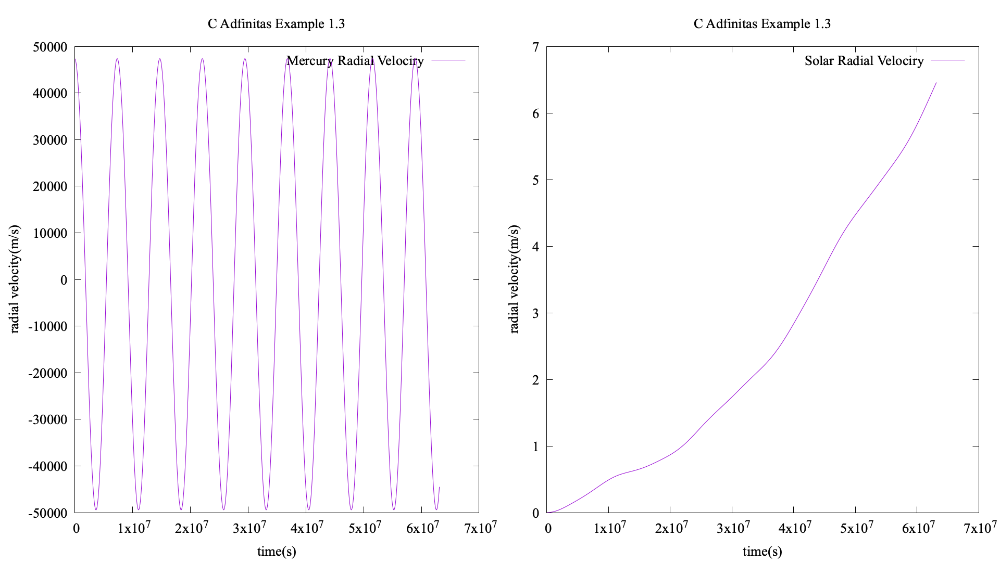

# Adfīnitās

C N-body simulation program with distributed support. It is the new edition of [Juila Adfīnitās package](https://github.com/Umaru-Xi/Adfinitas "Julia Adfīnitās"). Fixed memory consumpting problem and speed up. 

Now distributed computing support is comming back with MPI.

All integrators are sympletic integrator, but Verlet method have some known problem on Hamilton conservation(To be continued).

This simulator does not solve collision. So in the example 3.2, the Hamilton of system is not conservated.

* * *  

Dependency: openMP(not now);

Example dependency: GNU Plot, make, cc;  

* * * 

There are some examples just same as Julia edition.

Examples in examples/, just run: # make all, or using MPI with # make all_mpi 

1. Solar system up to Jupiter;  
    a. Orbits;  
          
    b. System Hamilton;  
          
    c. Radial velocity of Mercury and Solar;  
          
2. Sun-Earth-Moon system, but Moon has velocity on z-axis;  
    a. orbits;  
          
3. N-Body simulation with 1000 bodies; 
    a. 1000-bodies animation;  
          
    a. system Hamilton;  
          
    